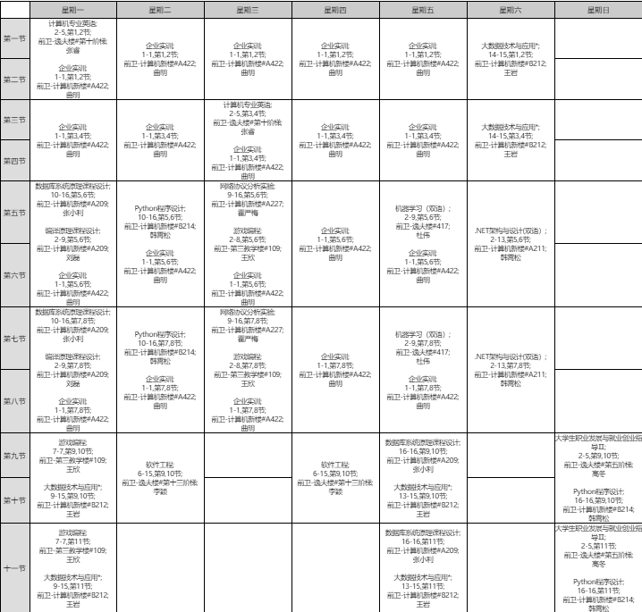

## hxn's homework
# Welcome to My Page

#### 这里是21181312胡轩宁的博客(just for computer English).
## an H2 sized header
#### an H4 sized header
这里是我的学校[吉林大学](https://www.jlu.edu.cn/).
***
这是我的[个人信息（另一个markdown文件）](./career.md).
***
## an image that is a file in the directory.
.
## an image that is located on the web
[](https://img-blog.csdn.net/20180605171615667?watermark/2/text/aHR0cHM6Ly9ibG9nLmNzZG4ubmV0L2hvaGFpeng=/font/5a6L5L2T/fontsize/400/fill/I0JBQkFCMA==/dissolve/70).
***
## a code block
```cpp
#include<iostream>
using namespace std;
int main()
{
  cout<<"21181312胡轩宁"<<endl;
  return 0;
}
```
***
## block quote
> Good good study, day day up! - Luxun(wrong)
***
## List
#### bulleted list
* ~PHP是最好的语言！~
* ~呵，弱类型的辣鸡。~
#### numbered list.
1. 胡
2. 轩
3. 宁
4. 2
5. 1
6. 1
7. 8
8. 1
9. 3
10. 1
11. 2
***
## table
人名\颜值|*帅*|*丑*|
---|---|----|
**hxn**|是|不是|
**hzy**|不是|是|
